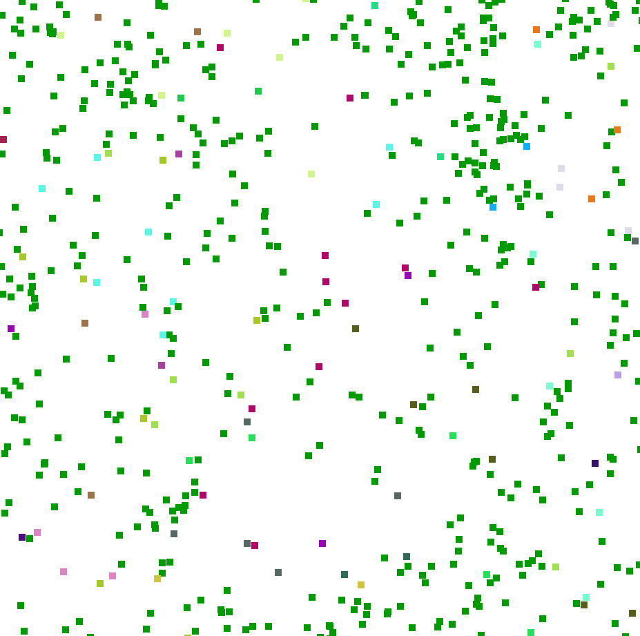

# Guys

A vector-based simulation of life, kinda.

Square colored entities known as "Guys" will die if they have no energy, which is constantly getting wasted depending on their speed, which is random. They seek out food for energy, and reproduce at a certain energy threshold. A faster speed will shorten a entity's range for finding food, and a slower speed will enlarge it. Depending on how often food is produced, entities with particular traits (for now it's just speed) will survive and reproduce better than other ones.

## Features

* You can add food by left clicking and add a random moving entity with the right.
* Pressing Tab will open the gui.
