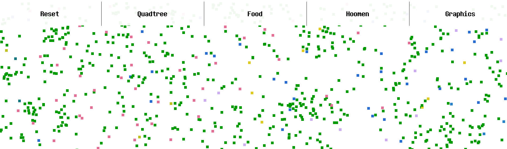
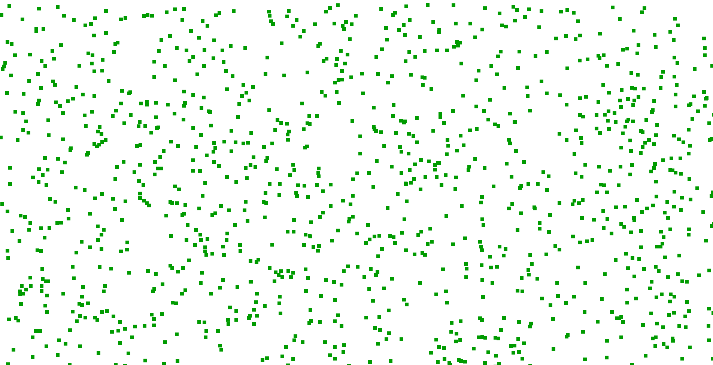
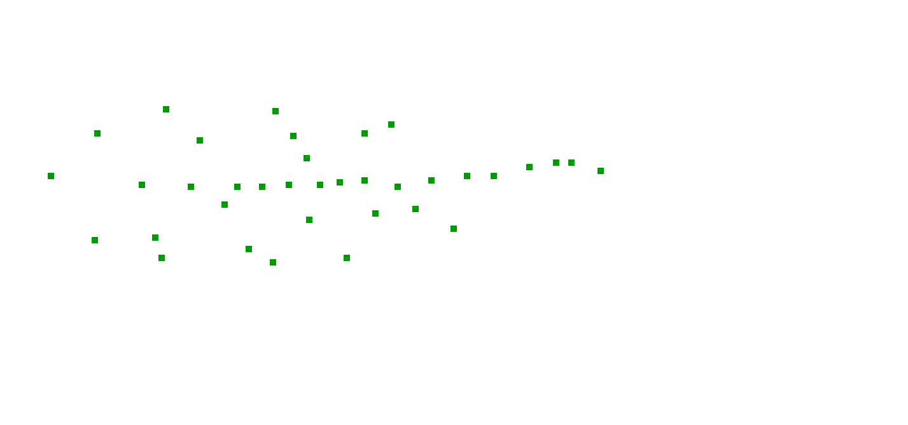

# Guys

Guys is a vector-based simulation of life implemented with a Quadtree and a GUI, where every moving square you see on screen is a "Guy" that tries to dominate the population with a single color.  

## GUI

By far the biggest hurdle of this project was making a GUI from scratch, as I had the *audacity* to do so. By simply hitting `tab`, you can toggle a menu in-game that will provide you an interface that customizes settings real-time. 

## Quadtree
A quadtree was necessary in this simulation due to the sheer number of collision checks each Guy has to make in order to chase down the closest bit of food. Using the quadtree I used in a previous project using a [fast unordered map](https://github.com/Tessil/hopscotch-map), I managed to modify it so that it can be used on Guys. On start, the quadtree is continuously pruned and updated up to 5 iterations.  

## Food

Food is denoted as a green square. Every few frames, an arbitary amount of food is generated at random locations at the map.

## Speed

Each Guy has an innate attribute that is randomized at birth that determines his FOV -- speed. Speed is a randomized value that is between 1 and 9.9, where the value represents the amount of pixels traveled in a given direction per frame. The higher the speed a Guy has, the lower his FOV, as if he was running so fast everything blurred around him. Conversely, the lower the speed a guy has, the higher his FOV, as if he were strolling calmly and looking around. In practice, the FOV is determined by dividing the maximium FOV by speed linearly, and is the "evolution" aspect of this simulation; Guys with the right balance of speed and sight will consume more food than those who don't have that balance.

## Behaviour 
### Eating
Each guy on screen actively tries to find the nearest piece of food on screen that intersects with his FOV box. If there isn't food available, the Guy will continue to move the direction he's going until he hits a wall, where he will bounce back.  

### Starvation
If a guy runs around long enough without getting food, he will die as if by starvation. The attribute that determines this is `energy`, which starts at 300 for each Guy at birth. `Energy` is depleted at a rate of `0.5 * (speed ^ 2)` per frame, so faster Guys tradeoff their lifespan in exchange for speed, and slower Guys tradeoff speed for living a lot longer. 

### Reproduction
If a guy has *a lot* of energy in his pocket due to eating a bunch of food, the guy reproduces at the cost of losing a lot of his energy. Of course, as there are no XX chromosomes in the entire population, the guy goes through parthenogenesis and produces a baby, somehow. *Look, don't ask.* Anyhow, when reproducing, the guy spawns an exact clone of himself around himself at a radius of `5 * size`. Except for energy, the Guy's velocity and color are passed on to his baby, which starts at an energy of 300.

### War
If ANY instance of a Guy collides with another instance, even if it's the same family, they will fight. "Fighting" in this simulation is the act of killing based on the Guy who has the higher amount of energy, as if overwhelmed by strength. Due to this, overpopulation and overlapping cannot exist in the simulation, which is how "armies" of a single color can diffuse through the space rather than stack on a single area and become indestructible. 

## Full GUI Settings

* `Reset` - Resets the entire playfield to ground zero. Initial food and initial Guys will be spawned when this happens. 
* `Quadtree / Render` - Toggles the rendering the quadtree and its current nodes.
* `Quadtree / Iterations` - The number of iterations to do with the quadtree; Keeping this between 3 - 6 will help reduce lag depending on the size of the Guys and Food. 
* `Food / Initial Count` - The initial amount of food generated every `RESET`.
* `Food / Growth Time Interval` - The number of frames needed to pass in order to generate the next lot of food.
* `Food / Plants Per Growth` - The amount of plants, or food, generated per lot. 
* `Food / Size` - The size of the food's size. The bigger the size, the easier it is for a Guy to see it and collide with it.
* `Guys / Initial Count` - The initial count of Guys spawned each `RESET`.
* `Guys / Sight` - The maximum amount of FOV a guy is allowed to have at speed 0; It is scaled proportionally to the Guy's speed. 
* `Guys / Render Sight` - Toggles the rendering of each Guy's FOV square. 
* `Guys / Size` - The size of each guy, in pixels. The bigger it is, the bigger the Guy, meaning frequent battles with neighbors. 
* `Graphics / VSync` - Toggles vsync; Whether or not to override the framerate do that it matches the refresh rate of your monitor. 
* `Graphics / FPS Counter` - Toggles the FPS counter. The counter itself is visible in the command line.
* `Graphics / FPS` - If `VSync` is turned off, the program will try to run the simulation at this framerate. 

# Mouse 
* Left click spawns food.
* Right click spawns an entity with a speed between 1 and 9.9.

# Compiling on Linux
This project uses CMake in order to generate a make file. Install CMake through whatever means necessary, though the easiest would be using `sudo apt-get install cmake` on the command line. 

In addition to this, you must install the dev versions of [SDL2](https://www.libsdl.org/), [SDL2_image](https://www.libsdl.org/projects/SDL_image/), and [SDL2_ttf](https://www.libsdl.org/projects/SDL_ttf/). On Debian, this can be done by calling `sudo apt-get install libsdl2-dev libsdl2-image-dev libsdl2-ttf-dev`. 

Then, run `installDependencies.bash` to download other dependencies onto the project directory. After that, you can compile this project by simply running `compile.bash` to compile an executable into `executable/`. It's as easy as that! 

# Compiling on Windows
## Requirements
Installing prerequisites on Windows is a bit more complicated. First, download the binary executable of [CMake](https://cmake.org/) and install it. Be sure to install the executable that matches your system architecture.

After that, create a folder named `Dependencies`. In that folder, create a folder titles `SDL_FULL` and put two folders named `include` and `x86` inside it; Here is where you put the header files of SDL2, SDL2_image, and SDL_tff in `include` and their x86 .lib files into `x86`. After that, follow these steps
* Get the `SDL2-devel-2.0.x` archive from [here](https://www.libsdl.org/release/)
* Get the `SDL2_image-devel-2.0.x` archive from [here](https://www.libsdl.org/projects/SDL_image/release/)
* Get the `SDL2_ttf-devel-2.0.x` archive from [here](https://www.libsdl.org/projects/SDL_ttf/release/)
* For each archive, unzip the contents of their `include` folder into `Dependencies/SDL_FULL/include` and `lib/x86` folder into `Dependencies/SDL_FULL/x86`
* Move all the .dll files into a separate folder at the root of the project; This is where your executable will run. 

This project also requires the use of two open-source libraries [nlohmann/json](https://github.com/nlohmann/json) and [Tessil/hopscotch-map](https://github.com/Tessil/hopscotch-map). Download the `include.zip` file in [nlohmann/json](https://github.com/nlohmann/json) and put its contents in a folder titled `json` in `Dependencies/`, and clone / download the source code of [Tessil/hopscotch-map](https://github.com/Tessil/hopscotch-map) and rename the folder for the project as `hopscotch-map` and put it in `Dependencies/`. After that, you're all set!

## Compiling
To compile this project, you need to use CMake and your prefered compiler to generate a x86 (32-bit) version of your solution / executable. 

After this, the compiled executable must be put into ANY folder in the root directory of the project along with the aforementioned .dll files of SDL2. After this, you can run the game :)
